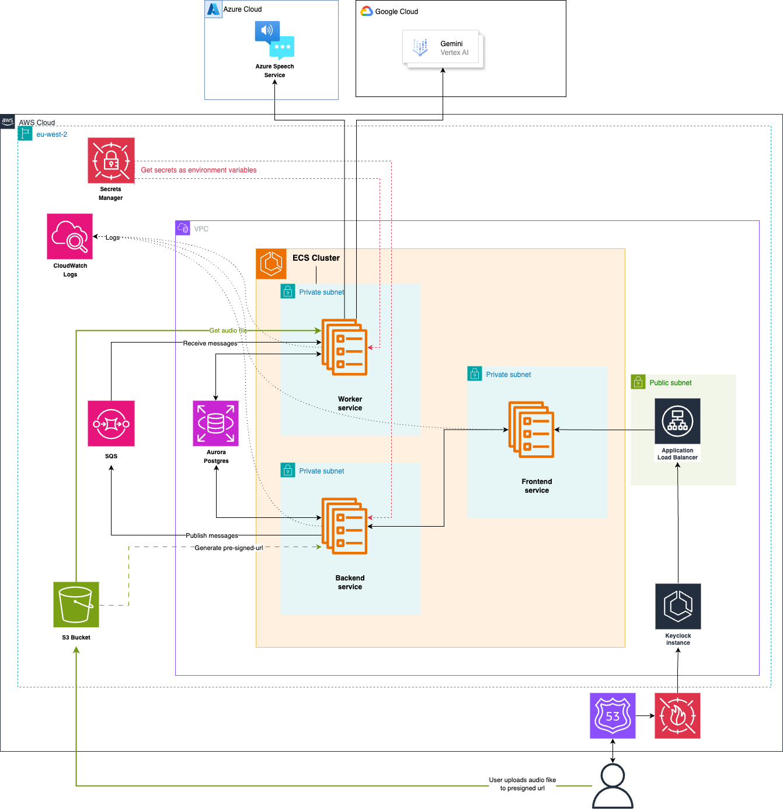
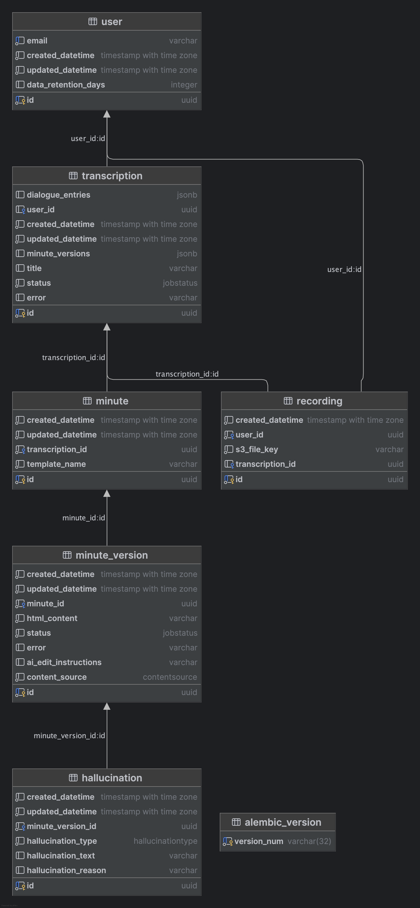

[](https://github.com/i-dot-ai/minute/actions/workflows/build.yml?query=branch%3Amain)

# Minute

> [!IMPORTANT]
> Incubation Project: This project is in active development and a work in progress.

Minute is an application that is designed to simplify the transcription and minuting of meetings in the public sector. Built with modern web technologies and AI-powered transcription and summarisation services, Minute transforms how government organisations handle meeting documentation by automating the conversion of audio recordings into structured, professional minutes.

## Key Features

**AI-Powered Transcription**: Minute integrates with multiple transcription services including Azure Speech-to-Text and AWS Transcribe, automatically selecting the most appropriate service based on audio duration and quality. The system handles various audio formats and automatically converts them to optimize transcription accuracy.

**Professional Meeting Templates**: The application includes specialized templates tailored for different types of government meetings, including Cabinet meetings, planning committees, care assessments, and general-purpose meetings. Each template follows specific formatting standards and style guides required for official documentation.

**Intelligent Minute Generation**: Beyond simple transcription, Minute uses AI to structure conversations into professional minute formats, applying proper grammar, tense conversion, and formatting rules specific to government documentation standards.

**Multi-Format Audio Support**: Upload recordings in various formats - the system automatically handles conversion and optimization for the best transcription results. Support for mono and multi-channel audio ensures compatibility with different recording setups.

**Data Retention**: Configurable data retention policies ensure compliance with government data handling requirements, with special provisions for different departments' retention policies.

**Real-Time Processing**: Asynchronous processing architecture ensures efficient handling of large audio files, with job status tracking and progress monitoring throughout the transcription and minute generation process.

Minute streamlines the traditionally time-intensive process of creating meeting minutes, allowing public sector organizations to focus on decision-making rather than documentation overhead.

## Development

### Canonical local workflow

Docker is no longer the canonical local development path for this repository. The preferred workflow is direct local processes plus a locally installed PostgreSQL instance.

1. Copy `.env.example` to `.env` and fill in the required values.
2. Install dependencies:

```bash
cd ..
pnpm install
cd minute-main
poetry install --with dev --without worker
```

3. Run the canonical frontend from the repo root:

```bash
cd ..
pnpm dev:web
```

4. Run the backend directly:

```bash
cd minute-main
QUEUE_SERVICE_NAME=noop STORAGE_SERVICE_NAME=local poetry run uvicorn backend.main:app --reload --port 8080
```

5. Run backend smoke tests directly:

```bash
cd minute-main
poetry run pytest tests/test_health.py tests/test_export_handler_service.py tests/test_cost_guard.py tests/test_security_headers.py
```

### Optional worker runtime

The current worker still uses the legacy Ray runtime. It is not required for day-to-day frontend and backend development.

```bash
cd minute-main
poetry install --with dev,worker
QUEUE_SERVICE_NAME=noop STORAGE_SERVICE_NAME=local poetry run python worker/main.py
```

### Legacy Docker workflow

`docker compose`, Dockerfiles, and image-build workflows remain in the repository only as legacy infrastructure while they are being decommissioned. Do not treat them as the source of truth for new setup instructions or developer workflows.

## Project structure

#### `frontend/`

`frontend/` is now a frozen legacy reference. The canonical web frontend lives in `../universal-app/`, and OpenAPI generation is owned there via `pnpm --filter universal-app openapi-ts`.

#### `backend/`

The backend uses FastAPI and is responsible for making initial database writes and sending long running processes to a queue (typically SQS)

#### `worker/`

The worker reads from the queue and executes transcription/file conversion/llm calls, and updates the database with the results

## Deployment

#### Architecture diagram

Minute was developed to run on AWS and/or Azure, with abstractions available for message queues and cloud storage. That deployment history does not change the canonical local developer workflow, which is now direct-process and non-Docker.



See `docs/architecture.md` for the current target architecture and roadmap crosswalk.

#### Database Schema



#### Sentry setup (optional)

To set up sentry for telemetry, create an account at [sentry.io](sentry.io).

- Navigate to the `projects` page
- Click `Create project`
- Select `FASTAPI` as project type
- Click create
- On the following page, in the `Configure SDK`, copy the value for `dsn=` **KEEP THIS SECRET**
- Navigate to the SSM parameter store entry for your deployed application
- Replace `SENTRY_DSN` value with the value you copied

#### Posthog setup (optional)

To set up posthog for UX tracking, feature flags etc, create an account at [eu.posthog.com](https://eu.posthog.com/).

- create a project and obtain an API key (it should start `phc_`)
- set the key `POSTHOG_API_KEY` value in your `.env`

## Testing

To run unit tests:

```bash
make test
```

### Testing paid APIs and LLM prompt evaluations

A special set of tests are available to evaluate paid calls to LLM providers. Since we don't want to run this all the
time, we enable these with:

```bash
ALLOW_TESTS_TO_ACCESS_PAID_APIS=1
```

is in your `.env` file.

In order to run some tests, you will need some preprocessed transcript `.json` files. These should be located in
the top level `.data` dir in the repo. Within this directory, different subdirectories are routed to
different tests (see [test_queues_e2e.py](tests/test_queues_e2e.py) for an example).

## Adding custom templates

You can add your own templates by implementing either the `SimpleTemplate` or `SectionTemplate` protocols (see [here](backend/templates/types.py))
Simply put them in the [templates](backend/templates) directory, and they will automatically be discovered when the backend starts.
